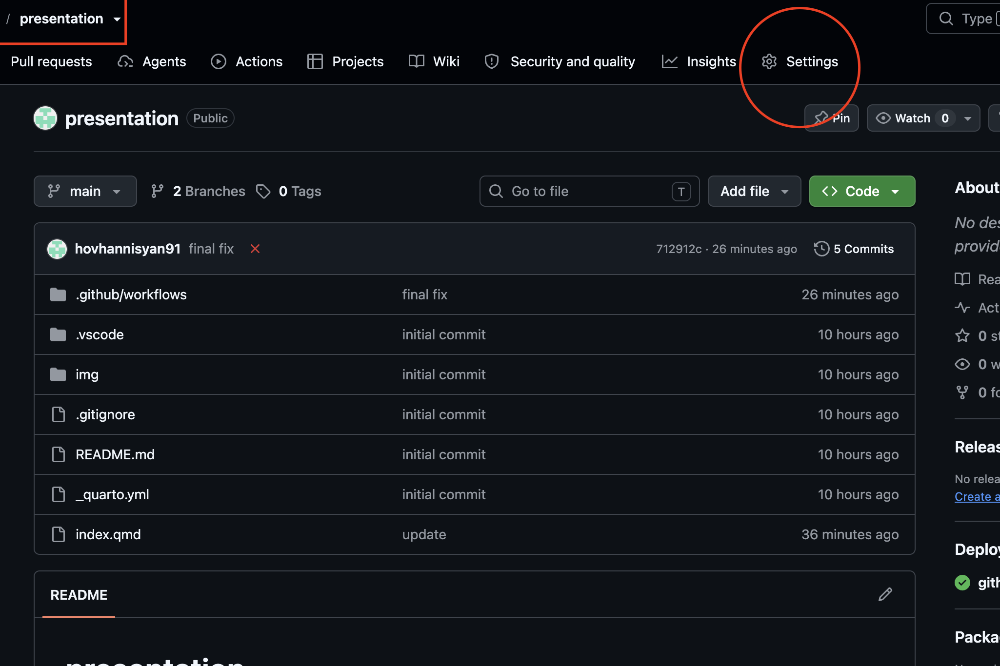
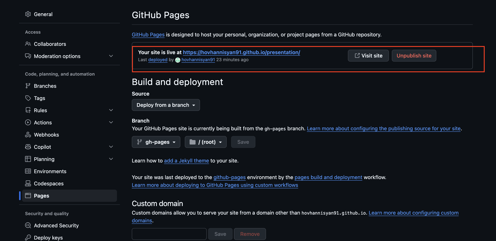

# Quarto Presentation Template

Use this repository to create and publish a Reveal.js slide presentation with
[Quarto](https://quarto.org/). Every push to `main` automatically renders the
slides and publishes them with GitHub Pages.

**Live example:** <https://hovhannisyan91.github.io/presentation/>

## What is in this repository?

| File or folder | Purpose |
| --- | --- |
| `index.qmd` | Presentation content and Reveal.js options |
| `_quarto.yml` | Quarto project and website configuration |
| `img/` | Images, logos, and other presentation assets |
| `.github/workflows/ci.yml` | GitHub Actions workflow that publishes the slides |
| `docs/` | Local rendered output; generated by Quarto and ignored by Git |

## 1. Create your own copy

Use either of these approaches:

- **Fork:** select **Fork** at the top of this GitHub repository. This keeps a
  visible connection to the original repository.
- **Download:** select **Code → Download ZIP**, extract it, create a new GitHub
  repository, and upload or push the files there.

If you use Git from the command line, clone your new repository:

```bash
git clone https://github.com/YOUR-USERNAME/YOUR-REPOSITORY.git
cd YOUR-REPOSITORY
```

Replace `YOUR-USERNAME` and `YOUR-REPOSITORY` with your GitHub username and
repository name.

## 2. Create a Python virtual environment

Python is not required for basic Quarto slides, but a virtual environment is
recommended if your presentation will run Python code or install Python
packages. It keeps the packages for this project separate from the rest of your
computer.

First, check that Python is installed:

```bash
python --version
```

Create a virtual environment named `venv` inside the repository:

```bash
python -m venv venv
```

Activate it on macOS or Linux:

```bash
source venv/bin/activate
```

Activate it on Windows PowerShell:

```powershell
.\venv\Scripts\Activate.ps1
```

Activate it on Windows Command Prompt:

```bat
venv\Scripts\activate.bat
```

When activation succeeds, the terminal prompt normally begins with `(venv)`.
Upgrade `pip` before installing any Python packages:

```bash
python -m pip install --upgrade pip
```

To leave the virtual environment later, run:

```bash
deactivate
```

> Do not commit the environment to Git. This repository's `.gitignore` already
> excludes `venv/`.

### Ignore generated and local folders

Open `.gitignore` and make sure it contains these entries:

```gitignore
# Quarto-generated website
docs/

# Local Python virtual environment
venv/
```

The `docs/` folder contains files generated by `quarto render`, while `venv/`
contains packages installed only on your computer. Neither folder should be
committed because GitHub Actions rebuilds the presentation and publishes the
generated files to the `gh-pages` branch automatically.

## 3. Install the tools

Install:

1. The [Quarto CLI](https://quarto.org/docs/download/)
2. A text editor such as [Visual Studio Code](https://code.visualstudio.com/)
3. The [Quarto VS Code extension](https://marketplace.visualstudio.com/items?itemName=quarto.quarto) (recommended)
4. [Git](https://git-scm.com/downloads) if you plan to work from the command line

### Install the Quarto CLI

Open <https://quarto.org/docs/download/> and download the installer for your
operating system. Follow the installer instructions, then close and reopen your
terminal so it can find the new command.

Quarto is a separate system application; it is not installed inside the Python
virtual environment with `pip`.

Check that the Quarto CLI is available:

```bash
quarto --version
```

If the command is not found, restart your terminal or computer and try again.
On Windows, also confirm that the Quarto installer added Quarto to `PATH`.

## 4. Customize the presentation

Open `index.qmd` and update the YAML block at the top:

```yaml
---
title: "My Presentation"
subtitle: "My Subtitle"
author: "My Name"
date: last-modified
format:
  revealjs:
    touch: true
    chalkboard: true
---
```

Write slide content below the YAML block. A level-one heading starts a new
title slide, and a level-two heading starts a regular slide:

```markdown
# Section title

## Slide title

- First point
- Second point
```

Put images in `img/` and reference them with a relative path:

```markdown

```

Also update the site title in `_quarto.yml`. If you do not have a favicon,
replace or remove references to `img/favicon.png` in `index.qmd`.

## 5. Preview locally

From the repository directory, run:

```bash
quarto preview
```

Quarto opens the presentation in a browser and refreshes it after saved
changes. Press `Ctrl+C` in the terminal to stop the preview.

To create the final files without starting a preview server, run:

```bash
quarto render
```

The rendered site is written to `docs/` because `_quarto.yml` sets
`output-dir: docs`.

## 6. Publish with GitHub Pages

Commit and push your changes to the `main` branch:

```bash
git add .
git commit -m "Create my presentation"
git push origin main
```

The workflow in `.github/workflows/ci.yml` will:

1. install Quarto;
2. create the `gh-pages` branch if it does not exist;
3. render the presentation; and
4. publish the result to `gh-pages`.

Open the repository's **Actions** tab and wait for **Quarto Publish** to show a
green check mark.

## 7. Fix the GitHub Pages settings

GitHub may not select the publishing branch automatically the first time.

### Open Settings

On the repository page, select **Settings**.



### Select the publishing source

In the left sidebar, select **Pages**. Under **Build and deployment**, choose:

- **Source:** `Deploy from a branch`
- **Branch:** `gh-pages`
- **Folder:** `/ (root)`

Then select **Save**.


> The `gh-pages` branch appears only after the **Quarto Publish** workflow has
> run successfully at least once. If it is missing, run the workflow from
> **Actions → Quarto Publish → Run workflow**, then refresh the Pages settings.

### Find and check the URL

After deployment, the Pages settings show **Your site is live at** followed by
the public link. Select **Visit site** to test it.



For a normal project repository, the address is:

```text
https://YOUR-USERNAME.github.io/YOUR-REPOSITORY/
```

The first deployment can take a few minutes. Keep the trailing `/` when sharing
the URL.

## Updating the published slides

Edit `index.qmd` or files in `img/`, then commit and push to `main`. The workflow
runs again and updates the same Pages URL automatically.

## Troubleshooting

### The workflow has a red X

Open **Actions → Quarto Publish**, select the failed run, and read the failing
step. If the log says the workflow cannot push to `gh-pages`:

1. open **Settings → Actions → General**;
2. scroll to **Workflow permissions**;
3. select **Read and write permissions** and save; and
4. rerun the failed workflow.

Organization or classroom policies may prevent students from changing this
setting. In that case, ask the repository owner or instructor to enable write
access for GitHub Actions.

### The Pages URL returns 404

Check that:

- the **Quarto Publish** workflow completed successfully;
- **Settings → Pages** uses `gh-pages` and `/ (root)`;
- the URL contains the exact repository name, including capitalization; and
- you waited a few minutes after the first deployment.

### Changes do not start a deployment

The workflow currently watches `index.qmd`, `_quarto.yml`, the workflow file,
and everything under `img/`. If you add presentation source files elsewhere,
add their paths under `on.push.paths` in `.github/workflows/ci.yml`, or remove
the `paths` filter so every push triggers a deployment.

### The presentation works locally but not on Pages

Use relative asset paths such as `img/chart.png`, not local computer paths such
as `/Users/name/Desktop/chart.png`. Remember that GitHub filenames are
case-sensitive: `Chart.png` and `chart.png` are different files.

## Current deployment status

At the time this guide was written, the example site was successfully deployed
from the root of the `gh-pages` branch and returned HTTP `200`:

<https://hovhannisyan91.github.io/presentation/>
