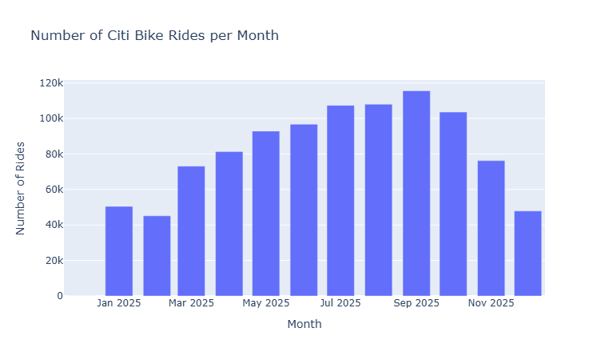
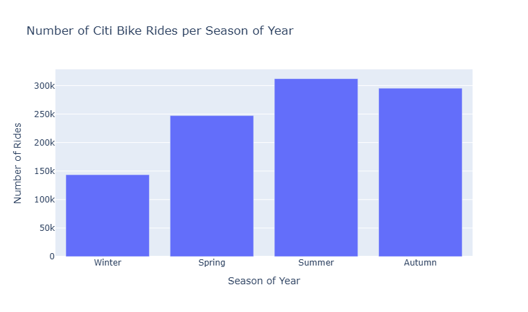
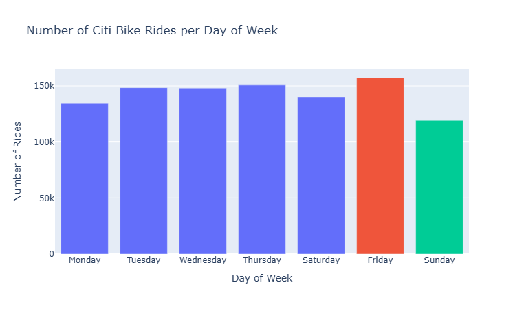
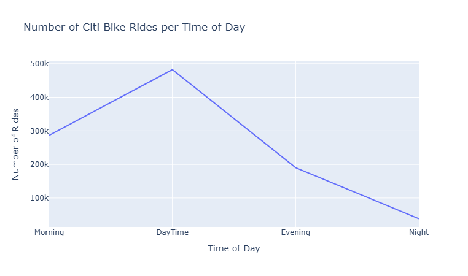
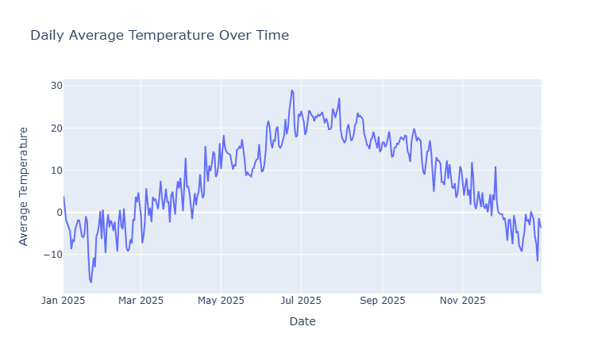
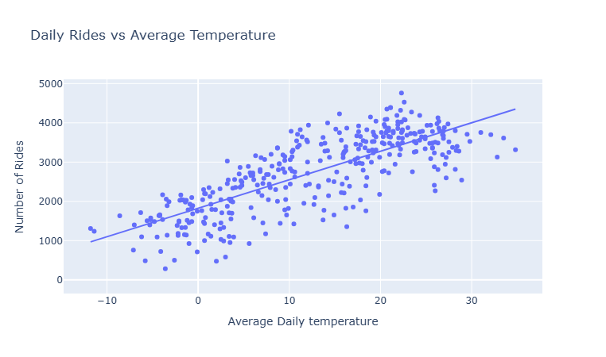
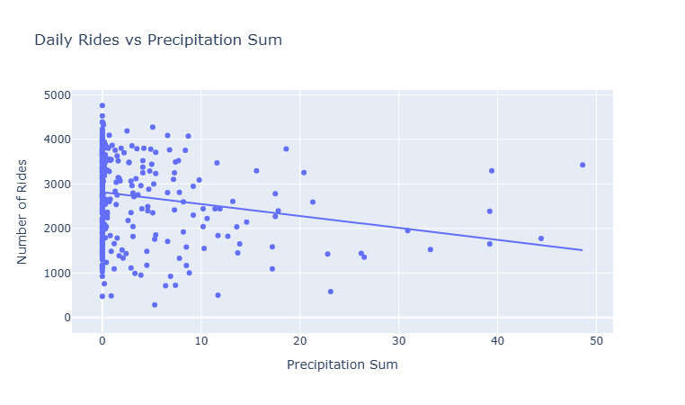
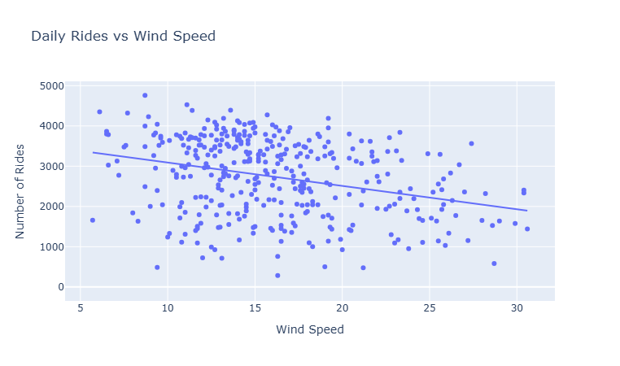
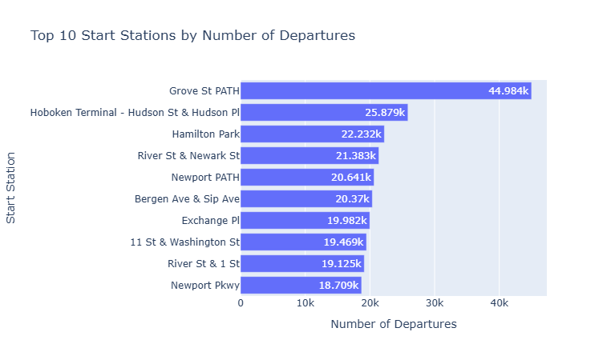

# Introduction

## Project Goal

- Analyze Citi Bike trip data from Jersey City
- End-to-end pipeline: from data acquisition to geospatial insights
- Built with Python (pandas, plotly, folium)

## Questions We're Answering

- When and where do most trips happen?
- How does weather affect ridership?
- Which stations are the most active?

# Ridership Patterns

## Rides per Month

{width="80%" fig-align="center"}

::: {.notes}
Ridership grows steadily from winter into a September peak (~115k), then drops off through late fall.
:::

## Rides per Season

{width="80%" fig-align="center"}

## Rides per Day of Week

{width="80%" fig-align="center"}

## Rides per Time of Day

{width="80%" fig-align="center"}

# Weather Impact

## Daily Average Temperature Over Time

{width="80%" fig-align="center"}

## Rides vs. Temperature

{width="75%" fig-align="center"}

## Rides vs. Precipitation

{width="75%" fig-align="center"}

## Rides vs. Wind Speed

{width="75%" fig-align="center"}

# Station Analysis

## Top 10 Start Stations by Departures

{width="85%" fig-align="center"}

## Station Count Map

<iframe src="img/station_count_map.html" width="100%" height="500" style="border:none;"></iframe>

## Departures Map

<iframe src="img/departures_map.html" width="100%" height="500" style="border:none;"></iframe>

## Arrivals Map

<iframe src="img/arrivals_map.html" width="100%" height="500" style="border:none;"></iframe>

## Average Activity Map

<iframe src="img/avg_activity_map.html" width="100%" height="500" style="border:none;"></iframe>

## Total Activity Map

<iframe src="img/total_activity_map.html" width="100%" height="500" style="border:none;"></iframe>

## Busiest Routes

<iframe src="img/line_color_map.html" width="100%" height="500" style="border:none;"></iframe>

# Conclusions

## Key Findings

- Ridership peaks in **summer** (~310k rides) and is lowest in **winter** (~140k)
- **Friday** is the busiest day; **Sunday** is the quietest
- Most rides happen **midday**, dropping sharply at night
- Strong positive correlation between **temperature and ridership**
- Ridership decreases with higher **precipitation** and **wind speed**
- **Grove St PATH** is by far the top station, with ~45k departures — nearly double the next busiest station

# Thank You

# Contact

## Let's Connect

<strong>LinkedIn</strong> 
<a href="https://www.linkedin.com/in/vahe-yavryan-a2127a409/">linkedin.com/in/VahYavryan</a>

<strong>GitHub</strong> 
<a href="https://github.com/VahYavryan">github.com/VahYavryan</a>

<strong>Email</strong> 
vahyavryan5@gmail.com

